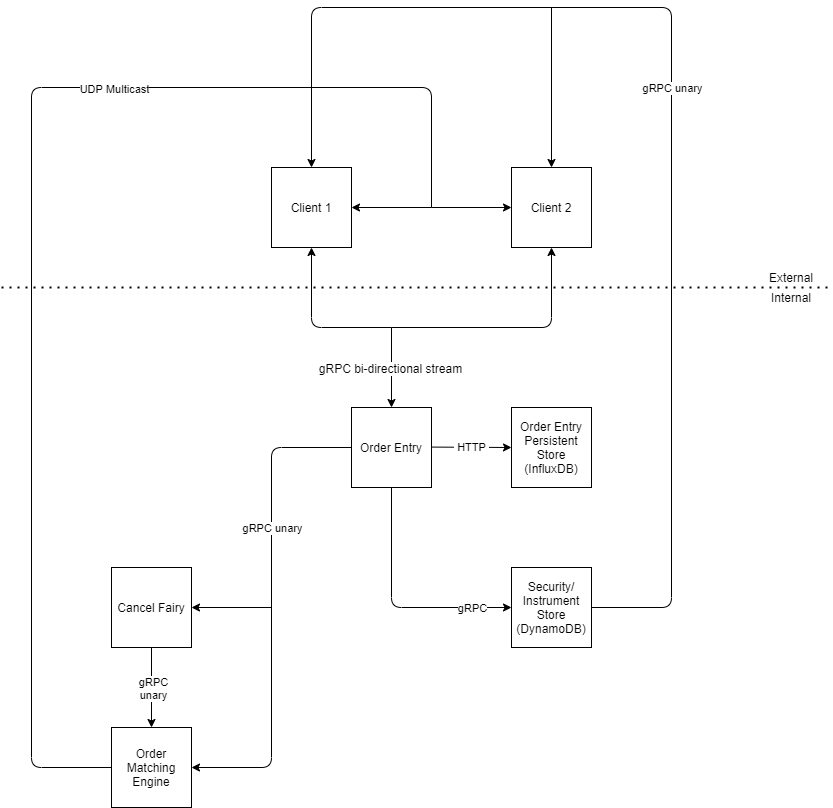

# About MPeXchange

MPeXchange (MPX) is a (mock) securities exchange written in C++20 hosted on Amazon Web Services (AWS).

## Architecture

MPeXchange's architecture is based on a microservice design, with specialized, unidirectional information streams.

The design architecture design is loosely based around the architecture presented in Jane Street's Brian Nigito's talk titled ["How to Build an Exchange"](https://www.janestreet.com/tech-talks/building-an-exchange/). In addition, the architecture of [Tzadiko/Trading-Engine](https://github.com/Tzadiko/Trading-Engine) has influenced the design of MPX.

A diagram of MPX's architecture is shown below:

### Components

- Order Matching Engine [v0.0.1] — This is the heart of the exchange. This component contains the order book, and implements order matching algorithms on it. Currently, the plan is to use the First-In-First-Out (FIFO) order matching algorithm, but support for Pro-Rata is planned.

- [Instrument Store](https://github.com/MPeXchange/Instrument-Store) [v0.1.0] — This component is a persistent store of all securities defined/traded on the exchange powered by AWS DynamoDB. Currently, this service (and MPX, by extension) only supports "equities-style" instruments. In the future, this service will be able to support derivatives (such as futures and options) and User Defined Instruments (UDIs).

- Cancel Fairy [Not Implemented Yet] — This component stores cancel orders set to execute some time in the future. At execution time, the cancel order will be sent to the order matching engine.
- Order Entry [Not Implemented Yet] — This component interfaces with clients to establish connections, listen to client heartbeats, and receive and sanitize order entries. This component will implement a protocol similar to the Financial Information eXchange (FIX) protocol.
- Order Entry Persistent Store [Not Implemented Yet] — This component will store all incoming orders. In the case that the order matching engine crashes, this component will be used to rebuild the state of the order book.

